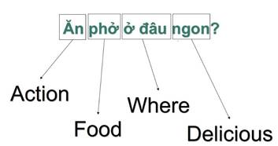
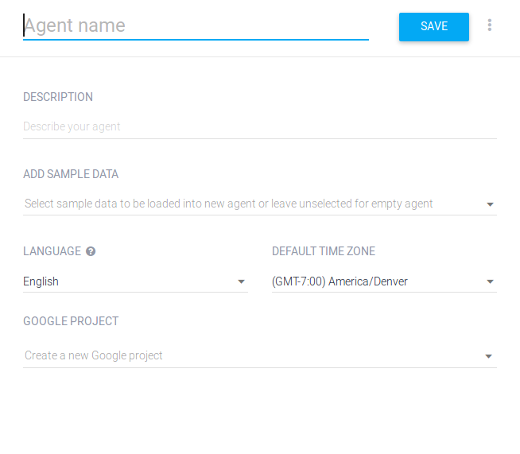
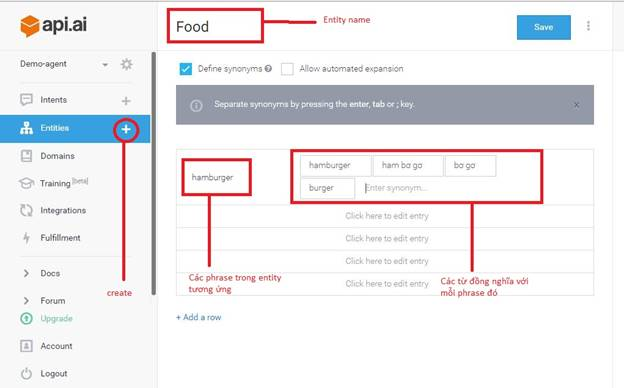
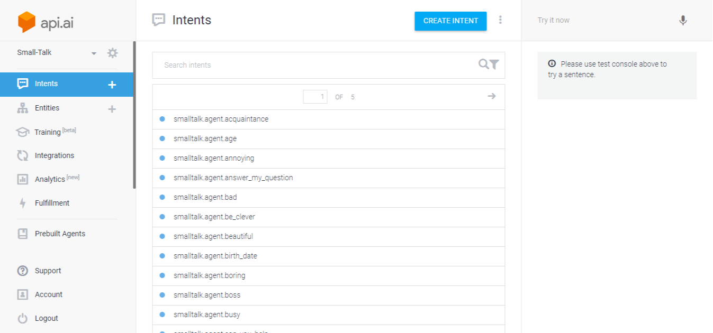
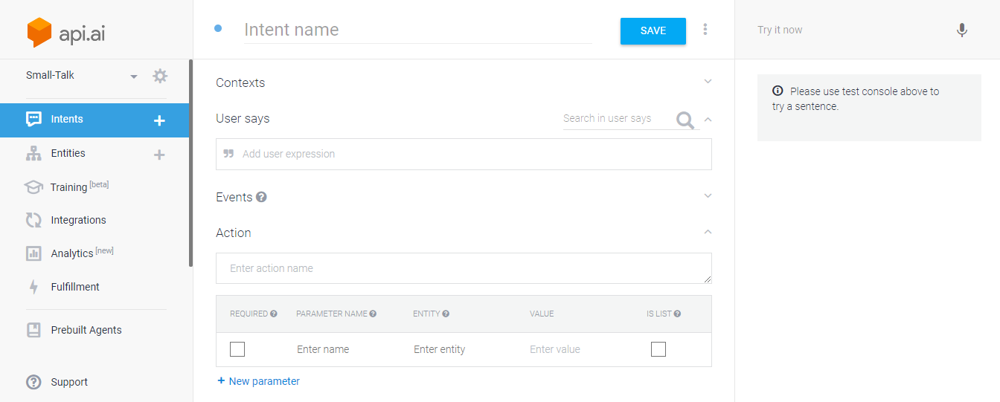
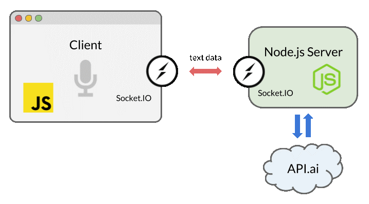
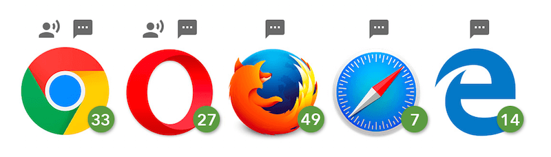
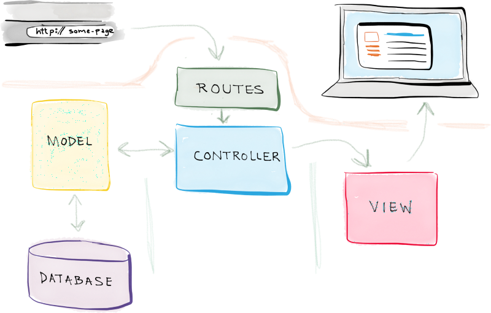

<p align="center"></p>

<p align="center">
<a href="https://speakaibot.herokuapp.com/"></a>
</p>

#### Thành viên trong nhóm <br>
- Tô Mạnh Hiệp
- Nguyễn Văn Tuệ


## Giới thiệu về Xử lý ngôn ngữ tự nhiên (Natural Language Processing) và công nghệ tích hợp xử lý ngôn ngữ tự nhiên API.AI

Mục đích: Chủ đề này giới thiệu về Xử lý ngôn ngữ tự nhiên  – một phương pháp mới để giúp cho máy có thể hiểu và phân tích được câu nói của con người và có thể chắc lọc ra những thông tin cần thiết. Bên cạnh đó, chủ đề này còn giới thiệu về công nghệ API.ai – công nghệ xử lý ngôn ngữ tự nhiên và giúp lập trình viên tương tác trao đổi thông qua RESTful Web Services.


- Trang chủ [API.AI](https://dialogflow.com/) (Mới đổi tên thành  Dialogflow) .
- Tài liệu [api.ai/docs](https://dialogflow.com/docs/getting-started/basics).


## Khái niệm về Xử lý ngôn ngữ tự nhiên (NLP)

Xử lý ngôn ngữ tự nhiên - [Natural Language Processing (NLP)](https://en.wikipedia.org/wiki/Natural_language_processing) – là một nhánh của trí tuệ nhân tạo, tập trung vào việc tương tác giữa máy tính và ngôn ngữ tự nhiên của con người, để từ đó máy tính có thể hiểu và thực thi đúng yêu cầu của con người.

Vậy làm thế nào để máy tính có thể hiểu được câu nói của con người?

Sau đây, tôi sẽ hướng dẫn các bạn cách giúp máy tính hiểu được ngữ nghĩa của một câu nói.

Đầu tiên chúng ta có một vài khái niệm:

**1. Lexical Category** – Nhóm từ vựng học.

- Khái niệm này giúp định danh cho một tập các từ hoặc cụm từ cùng mang một ý nghĩa hay đề cập đến một nội dung cụ thể.
- Khái niệm này giúp chúng ta có thể phân tích các thành phần trong một câu thành dạng tổng quát để có người khác có thể diễn đạt bằng nhiều cách hay sử dụng từ địa phương, từ lóng, … thì nó cũng cùng chung một ngữ nghĩa.
- Ví du: Food là một Lexical Category bao gồm các từ như bún bò, hủ tiếu, …

- Để hiểu rõ khái niệm này, chúng ta cùng phân tích một câu hỏi đơn giản như sau:

[](# "Ví dụ")

Câu hỏi trên được phân tích thành các Lexical Category như sau

[](# "Lexical Category")\

+ Action: dùng để chỉ các hành động của con người có liên quan tới thức ăn.
+ Food: dùng để chỉ các món ăn.
+ Where: dùng để xác định các từ để hỏi địa điểm.
+ Delicious: là tập hợp các từ chỉ độ ngon của thức ăn.
+ …: các lexical category khác tùy theo sự phức tạp của của một câu được phân tích

Từ câu ví dụ trên chúng ta có thể gom lại thành một chuỗi các Lexical Category như sau:
**[Action][Food][Where][Delicious]**

**2. Pattern** – cú pháp hay ngữ pháp hình thành trong một câu.

- Vi dụ:  [Action][Food][Where][Delicious].
  => Mục đích của pattern giúp xác định mẫu câu được dùng trong giao tiếp.

Đến đây, chúng ta đã hình thành nên khái niệm mẫu câu, ngữ pháp của câu để sử dụng trong giao tiếp và truyền đạt theo kiểu chúng ta được học trong ngôn ngữ tiếng Việt hay tiếng Anh.

Tuy nhiên, ngôn ngữ tự nhiên được hiểu theo ngữ cảnh – các câu giao tiếp có ý nghĩa khác nhau tùy theo không gian, địa điểm và nội dung đang được trao đổi, và không theo một một quy tắc nào. Vì vậy, pattern chưa đảm bảo việc xác định chính xác nghĩa một câu.

**3. Intent** – xác định ý định, hay mục đích của câu được phân tích dựa trên ngữ cảnh giao tiếp.

- Ví dụ:  với câu hỏi “**Ăn phở ở đâu ngon?**”, chúng ta hiểu intent “câu nói mong muốn xác định vị trí quán phở ở đâu là ngon”.

**Tổng kết:** muốn xử lý ngôn ngữ tự nhiên chúng ta cần phải xác định 03 thành phần cơ bản lần lượt là Lexical Category, Pattern, Intent để thông qua đó chúng ta sẽ dạy cho máy hiểu được các câu được chuyển tải trong quá trình giao tiếp.


## API.ai

**1. Giới thiệu và tính năng**
- Api.ai là một framework hỗ trợ xử lý ngôn ngữ tự nhiên (hiện tại, bộ này chưa hỗ trợ tiếng Việt) nhằm hỗ trợ người lập trình xây dựng một công cụ liên quan đến giao tiếp tự động giữa người và máy tính.
- Các tính năng:
  + Api.ai’s Speech Recognition: Hỗ trợ nhận diện giọng nói, chuyển đổi âm thanh – sound thành dạng văn bản – text.
  + Natural Language Understanding and Conversation Management: Xử lý ngôn ngữ tự nhiên và hỗ trợ giao tiếp.

**2. Một số khái niệm cơ bản trong API.ai sử dụng**

| **Khái niệm** |                **Mô tả**                 |
| :-----------: | :--------------------------------------: |
|     Agent     | Tương đương như một ứng dụng trong api.ai. Đây cũng là nơi chúng ta tích hợp vào ứng dụng của mình để có thể dạy và test bot. |
|    Entity     | Khái niệm tương tự như Lexical Category đã nói trên. |
|    Intent     | Xác định ngữ cảnh của câu và ứng xử trong giao tiếp. Có ý nghĩa tương tự như phần giải thích về intent trên |
|    Action     | Khi một intent được trigger thì action sẽ được thực hiện. Action đỏi hỏi các thông tin (parameter) tương ứng được tổng hợp từ các pattern kết hợp với các intent. |
|    Context    | Xác định ngữ cảnh của câu được phân tích hay giao tiếp. Context bao gồm các intent, cho biết các câu nói đó thuộc những ngữ cảnh tương ứng để có cách ứng xử cho phù hợp. |

- Đọc thêm [Basics Documentation](https://dialogflow.com/docs/getting-started/basics)

**3. Cách sử dụng**
Chúng ta có thể tích hợp api với ứng dụng của chúng ta bằng cách sử dụng REST-like API.

- Đọc thêm về [API](https://vi.wikipedia.org/wiki/Giao_di%E1%BB%87n_l%E1%BA%ADp_tr%C3%ACnh_%E1%BB%A9ng_d%E1%BB%A5ng) 
- Đọc thêm về [REST or RESTFUL](https://en.wikipedia.org/wiki/Representational_state_transfer)


## Hướng dẫn chi tiết sử dụng API.AI 

**1. Tạo mới Agent**



- Chọn tên duy nhất cho Agent và thiết lập các cài đặt:
  **Description** : Mô tả mục đích ứng dụng của bạn.
  **Add Sample Data** : Thêm một bộ dữ liệu có sẵn vào ứng dụng của bạn (Đây chính là phần prebuilt agents).
  **Default Language** : Chọn ngôn ngữ mặc định cho ứng dụng của bạn.
  **Default Time Zone** : Chọn múi giờ mặc định cho ứng dụng của bạn.

- Prebuilt Agent (Một số Agent API.AI xây dựng sẵn theo các tính năng nhất định như đặt vé, hội thoại, ...)


**2. Tạo Entity**



- Khởi tạo đầy đủ các bộ entities cho ứng dụng của mình.
- Ở bước này, chúng ta cần xác định rõ nghiệp vụ - business của ứng dụng cần xây dựng để từ đó xác định tập tự vựng tương ứng

**3. Tạo Intents**



- Intent trong api.ai là nơi lưu trữ các pattern (template mode) hoặc các dạng example (example – còn gọi là example mode) - để thực hiện dạy cho hệ thống biết cách ứng xử phù hợp – machine learning)

- Intent Contexts



- Intent Responses


## Ứng dụng

**1. Thiết kế**


Mô tả : Để xây dựng ứng dụng giao tiếp, nói chuyện với Bot, ta thực hiện qua ba bước ch:

- Sử dụng cínhông nghệ nhận dạng giọng nói Web Speech API’s SpeechRecognition để chuyển lời nói thành văn bản (Speech to text).
- Gửi chuỗi văn bản này lên API.AI để xử lý, sau đó trả về hội thoại tương ứng với lời người nói (Bot đã được chúng ta dạy các đoạn hội thoại).
- Văn bản (text) sau khi trả về thông qua công nghệ tổng hợp giọng nói (Text to speech) giao tiếp với người nói.

**Actor**

- Người dùng.
- Bot.
- API.AI (Hệ thống khác).

**Chức năng chính**

- Giao tiếp, hội thoại tiếng Anh với Bot
- Ngoài ra: Kiểm tra phát âm với Bot, Luyện từ vựng với Bot.


**2. Xây dựng hệ thống**



**2.1 Thành phần**

- **Client**: Giao diện ứng dụng, sử dụng các công nghệ nhận diện giọng nói, tổng hợp giọng nói để giao tiếp với người dùng.
- **Server**: Nơi tiếp nhận text từ phía client, giao tiếp với hệ thống api.ai để xử lý text, sau đó trả lại về client.
- **API.AI**: Platform xử lý ngôn ngữ tự nhiên.

**2.2 Công nghệ sử dụng**

- Server được xây dựng bằng Node JS và Socket.IO (để xây dựng ứng dụng realtime).

  Tìm hiểu thêm về [Node JS](https://nodejs.org/en/)

  Tìm hiểu thêm về [Socket.IO](https://socket.io/)

- Client sử dụng công nghệ Web Speech API để nhận dạng giọng nói (SpeechRecognition - Speech to text) và tổng hợp giọng nói (SpeechSynthesis - Text to speech).

  - Nhận dạng giọng nói - Được sử dụng thông qua `SpeechRecognition interface`, nó cung cấp khả năng nhận dạng ngôn ngữ từ âm thanh và trả về những nhận dạng thích hợp nhất.

    Nói chung, bạn sẽ tạo một đối tượng `SpeechRecognition`, nó có sẵn một số bộ xử lý sự kiện để phát hiện khi nào giọng nói được nhập thông qua micrô của thiết bị. `SpeechGrammar interface` chứa một bộ ngữ pháp cụ thể mà ứng dụng của bạn cần nhận ra. Ngữ pháp được định nghĩa bằng cách sử dụng `JSpeech Grammar Format` (JSGF).

  - Tổng hợp giọng nói - Được sử dụng thông qua `SpeechSynthesis interface`, nó cho phép các chương trình có thể "đọc" các đoạn văn bản mà chúng ta cung cấp.
    Bạn có thể sử dụng hay thay đổi các loại giọng nói khác nhau được cung cấp thông qua object `SpeechSynthesisVoice`.

  - Web Speech API là hoàn toàn miễn phí và được tích hợp trong các trình duyệt đời mới nên bạn có thể thoải mái sử dụng.

  - Tìm hiểu thêm về [Web Speech API](https://developer.mozilla.org/en-US/docs/Web/API/Web_Speech_API)

- API.AI - Platform trung gian xử lý ngôn ngữ  tự nhiên và AI.


**3. Cài đặt và sử dụng ứng dụng**

**Yêu cầu**

Trong ứng dụng này, chúng ta sẽ sử dụng API để tạo giao diện trò chuyện, hội thoại bằng trí tuệ nhân tạo (AI) trên trình duyệt web. Ứng dụng này sẽ lắng nghe giọng nói của người dùng và trả lời bằng giọng nói tổng hợp. Bởi vì Web Speech API vẫn đang trong quá trình thử nghiện nên ứng dụng này chỉ hoạt động trên các trình duyệt được hỗ trợ. Các tính năng nhận dạng giọng nói và tổng hợp giọng nói được sử dụng trong ứng dụng chatbot này hiện chỉ có trong các trình duyệt dựa trên Chromium, bao gồm Chrome 25+ và Opera 27+, còn Firefox, Edge và Safari chỉ hỗ trợ tổng hợp giọng nói.



Ứng dụng được xây dựng bằng ngôn ngữ Node.js. Dó đó bạn cần cài đặt Node.js và có kiến thức cơ bản về Node.js

**Thiết lập ứng dụng Node.js**

Trước tiên, chúng ta hãy thiết lập một khung ứng dụng web với Node.js. Tạo thư mục ứng dụng của bạn và thiết lập cấu trúc của ứng dụng như sau:

```lightning
├── index.js
├── public
│    ├── css : Chứa style của ứng .
│    	├── style.css
│    ├── js : 
│    	├── script.js
├── views 
      ├── index.html

```

Sau đó, chạy lệnh này để khởi chạy ứng dụng Node.js:

```lightning

$ npm init -f

```

Tham số -f chấp nhận cài đặt mặc định, nếu không bạn có thể chỉ định cấu hình ứng dụng theo cách thủ công mà không có tham số -f. Ngoài ra, tệp này sẽ tạo ra tệp package.json chứa thông tin cơ bản cho ứng dụng của bạn.

Bây giờ, cài đặt tất cả các package cần thiết để xây dựng ứng dụng này:

```lightning

$ npm install express socket.io apiai --save

```

Với tham số --save , tập tin package.json sẽ tự động cập nhật thông tin các package được cài đặt.

- Chúng ta sẽ sử dụng Express, một framework web của Node.js, để xây dựng server. 
Để kích hoạt khả năng giao tiếp hai chiều giữa máy chủ và trình duyệt, chúng ta sẽ sử dụng Socket.IO.
Ngoài ra, chúng ta sẽ cài đặt công cụ  API.AI để xây dựng một chatbot AI có thể tạo một cuộc trò chuyện nhân tạo.

- Socket.IO là một thư viện cho phép chúng ta sử dụng WebSocket một cách dễ dàng với Node.js. Bằng cách thiết lập kết nối socket giữa client và server, tin nhắn trò chuyện của người dùng sẽ được chuyển qua lại giữa trình duyệt và máy chủ của chúng ta, ngay khi dữ liệu văn bản được trả lại bằng API Speech Web (tin nhắn thoại) hoặc API.AI API (tin nhắn "AI").

Bây giờ, chúng ta hãy tạo ra một tệp index.js và lắng nghe máy chủ:

```lightning

const express = require('express');
const app = express();

app.use(express.static(__dirname + '/views')); // html
app.use(express.static(__dirname + '/public')); // js, css, images

const server = app.listen(3000);
app.get('/', (req, res) => {
  res.sendFile('index.html');
});

```

- Tuy nhiên, để linh hoạt hơn trong quá trình xây dựng, phát triển ứng dụng, cũng như để dễ dàng hơn trong việc bảo trì, sửa lỗi sau này, chúng ta sẽ thiết lập lại cấu trúc thư mục theo mô hình MVC (Một mô hình được sử dụng rộng rãi trong các web framework)
 
 **M là Model**: cấu trúc dữ liệu theo cách tin cậy và chuẩn bị dữ liệu theo lệnh của controller

**V là View**: Hiển thị dữ liệu cho người dùng theo cách dễ hiểu dựa trên hành động của người dùng.

**C là Controller**: Nhận lệnh từ người dùng, gửi lệnh đến cho Model để cập nhập dữ liệu, truyền lệnh đến View để cập nhập giao diện hiển thị.



Cấu trúc thư mục được xây dựng lại như sau:

```lightning
├── bin
├── config: Chứa các thiết lập của ứng dụng.
├── controllers
├── migrations: Chứa các file migration.
├── models: Chứa các file migration.
├── public
│    ├── css : Chứa style của ứng .
│    	├── style.css
│    ├── js : 
│    	├── script.js
├── seeder 
├── views 
      ├── index.html
├── app.js
├── package.json

```

**Nhận diện lời nói bằng SpeechRecognition Interface**

Web Speech API có giao diện điều khiển chính là ```SpeechRecognition```, để nhận diện phát biểu của người dùng từ micrô và hiểu những gì họ đang nói.

**Tạo giao diện người dùng**

Giao diện của ứng dụng đơn giản gồm một hộp thoại để hiện thị hội thoại và một nút để kích hoạt nhận diện giọng nói. Thiết lập tập tin index.html gồm tập tin front-end JavaScript và Socket.IO để xây dựng các kết nối thời gian thực:

```lightning

<html lang="en">
  <head>…</head>
  <body>
    …
    <script src="https://cdnjs.cloudflare.com/ajax/libs/socket.io/2.0.1/socket.io.js"></script>
    <script src="js/script.js"></script>
  </body>
</html>

```

**Bắt giọng nói bằng JavaScript**

Trong tập tin script.js, gọi một thể hiện của ```SpeechRecognition```, giao diện bộ điều khiển của Web Speech API để nhận dạng giọng nói:

```lightning

const SpeechRecognition = window.SpeechRecognition || window.webkitSpeechRecognition;
const recognition = new SpeechRecognition();

```

Chúng ta sẽ khai báo cả các đối tượng có tiền tố và không có tiền tố, bởi vì Chrome hiện hỗ trợ API với các thuộc tính có tiền tố.

Ngoài ra, chúng ta đang sử dụng một số cú pháp ECMAScript6 trong ứng dụng này, bởi vì cú pháp này bao gồm các hàm const và arrow function, có sẵn trong các trình duyệt hỗ trợ giao diện Speech API, ```SpeechRecognition``` và ```SpeechSynthesis```.

Theo tùy chọn, bạn có thể đặt các thuộc tính khác nhau để tùy chỉnh nhận dạng giọng nói:

```lightning

recognition.lang = 'en-US';
recognition.interimResults = false;

```

Sau đó, nắm bắt tham chiếu DOM cho nút trên giao diện và lắng nghe sự kiện nhấp chuột để bắt đầu nhận dạng giọng nói:

```lightning

document.querySelector('button').addEventListener('click', () => {
  recognition.start();
});

```

Khi nhận dạng giọng nói đã bắt đầu, sử dụng sự kiện kết quả để trích xuất những gì đã được nói dưới dạng văn bản:

```lightning

recognition.addEventListener('result', (e) => {
  let last = e.results.length - 1;
  let text = e.results[last][0].transcript;

  console.log('Confidence: ' + e.results[0][0].confidence);

  // Chúng ta sẽ sử dụng Socket.IO sau...
});

```

Đoạn code sẽ trả về một đối tượng ```SpeechRecognitionResultList``` chứa kết quả, và bạn có thể lấy ra văn bản trong mảng đó.

Bây giờ, chúng ta hãy sử dụng Socket.IO để chuyển kết quả cho máy chủ của chúng ta.

**Giao tiếp thời gian thực với Socket.IO**

Socket.IO là một thư viện cho các ứng dụng web thời gian thực. Nó cho phép giao tiếp hai chiều giữa các máy khách và máy chủ web. Chúng ta sẽ sử dụng nó để chuyển kết quả từ trình duyệt đến máy chủ Node.js, và sau đó gửi câu trả lời về trình duyệt.

Bạn có thể tự hỏi tại sao chúng ta không sử dụng HTTP request hoặc AJAX thay thế? Bạn có thể gửi dữ liệu đến máy chủ qua POST request. Tuy nhiên, chúng ta đang sử dụng WebSocket qua Socket.IO vì sockets là giải pháp tốt nhất cho truyền thông hai chiều, đặc biệt là khi đẩy một sự kiện từ máy chủ đến trình duyệt. Với kết nối socket liên tục, chúng ta sẽ không cần phải tải lại trình duyệt hoặc tiếp tục gửi yêu cầu AJAX trong khoảng thời gian thường xuyên.


Khởi chạy nhanh Socket.IO trong script.js:

```lightning

const socket = io();

```

Sau đó, chèn mã này vào nơi bạn đang nghe sự kiện kết quả (result) từ SpeechRecognition:

```lightning

socket.emit('chat message', text);

```

Bây giờ, hãy trở lại code Node.js để nhận văn bản này và sử dụng API.AI để trả lời cho người dùng.

**Lấy response từ API.AI**

Nhiều nền tảng và dịch vụ cho phép bạn tích hợp một ứng dụng với một hệ thống AI bằng cách sử dụng chuyển giọng nói thành văn bản và xử lý ngôn ngữ tự nhiên. Ở đây chúng ta sử dụng API.AI và tích hợp nó thống qua package có sẵn của Node.js

**Sử dụng API.AI Node.js SDK**

Hãy nối ứng dụng Node.js của chúng ta với API.AI bằng Node.js SDK của Node.js! Quay lại tệp index.js của bạn và khởi tạo API.AI bằng đoạn mã sau:

```lightning

const apiai = require('apiai')(APIAI_TOKEN);

```

Bây giờ chúng ta đang sử dụng Socket.IO phía máy chủ để nhận kết quả từ trình duyệt.

Khi kết nối được thiết lập và nhận được tin nhắn, sử dụng API.AI API để lấy trả lời từ tin nhắn của người dùng:

```lightning

io.on('connection', function(socket) {
  socket.on('chat message', (text) => {

    // Get a reply from API.AI

    let apiaiReq = apiai.textRequest(text, {
      sessionId: APIAI_SESSION_ID
    });

    apiaiReq.on('response', (response) => {
      let aiText = response.result.fulfillment.speech;
      socket.emit('bot reply', aiText); // Send the result back to the browser!
    });

    apiaiReq.on('error', (error) => {
      console.log(error);
    });

    apiaiReq.end();

  });
});

```

Khi API.AI trả về kết quả, sử dụng socket.emit của Socket.IO () để gửi nó trở lại trình duyệt.

**Trả lời người dùng bằng giọng nói sử dụng SpeeckSynthesis Interface**

Trở lại script.js một lần nữa để kết thúc ứng dụng!

Tạo một hàm để tạo ra một giọng nói tổng hợp. Lần này, chúng ta đang sử dụng giao diện điều khiển ```SpeechSynthesis``` của Web Speech API.

Hàm này lấy tham số đầu vào là một chuỗi  và cho phép trình duyệt đọc văn bản:

```lightning

function synthVoice(text) {
  const synth = window.speechSynthesis;
  const utterance = new SpeechSynthesisUtterance();
  utterance.text = text;
  synth.speak(utterance);
}

```

Trong hàm này, trước tiên, tạo một tham chiếu đến Web Speech API, ```window.speechSynthesis```. Bạn có thể nhận thấy rằng không có tiền tố đầu vào lần này: bởi vì ```SpeechSysthesis``` API này được hỗ trợ rộng rãi hơn ```SpeechRecognition```, và tất cả các trình duyệt hỗ trợ nó nên ta bỏ tiền tố cho ```SpeechSysthesis```.

Sau đó, tạo ra một trường hợp ```SpeechSynthesisUtterance ()``` mới bằng cách sử dụng constructor của nó và thiết lập văn bản sẽ được tổng hợp khi phát biểu. Bạn có thể đặt các thuộc tính khác, chẳng hạn như giọng nói để chọn loại giọng nói mà trình duyệt và hệ điều hành hỗ trợ.

Cuối cùng, sử dụng ```SpeechSynthesis.speak ()``` để cho nó nói!

Bây giờ, nhận được phản hồi từ máy chủ bằng cách sử dụng Socket.IO một lần nữa. Một khi nhận được tin nhắn, hãy gọi hàm này.

```lightning

socket.on('bot reply', function(replyText) {
  synthVoice(replyText);
});

```

**Demo**


**Source code**

[https://github.com/hieptm96/chatbot](https://github.com/hieptm96/chatbot) 

**Hướng dẫn cài đặt ứng dụng từ source code**

- Cài đặt NodeJS

  ```
  
   $ curl -sL https://deb.nodesource.com/setup_8.x | sudo -E bash -
   $ sudo apt-get install -y nodejs
   $ sudo apt-get install -y build-essential
   
  ```


- Cài đặt server (Sử dụng framework Express) và các module cần thiết (Socket io, api.ai, ...)

  ```
  
   $ git clone https://github.com/truonganhhoang/int3507-2017.git
   $ cd Nhom 10/chatbot
   $ npm install
   
  ```

- Chạy server 

  ```
  
   $ npm start
   
  ```

  Mặc định server chạy ở [http://127.0.0.1:3000](http://127.0.0.1:3000/)


### Demo Heroku

- [CHATBOT](https://speakaibot.herokuapp.com/) (Hội thoại tiếng Anh với AI Bot)

- [PRONUNCIATION CHECKER](https://speakaibot.herokuapp.com/pronunciation) (Kiểm tra phát âm tiếng anh với AI Bot)

- [VISION DETECT](https://speakaibot.herokuapp.com/vision) (Học từ vựng qua hình ảnh với AI Bot)


### Slide GitPitch 
- https://gitpitch.com/hieptm96/slidechatbot


### Docs

- [API.AI docs](https://api.ai/docs/getting-started/basics)