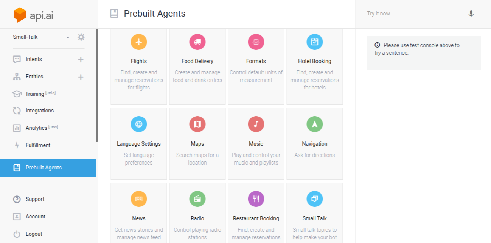
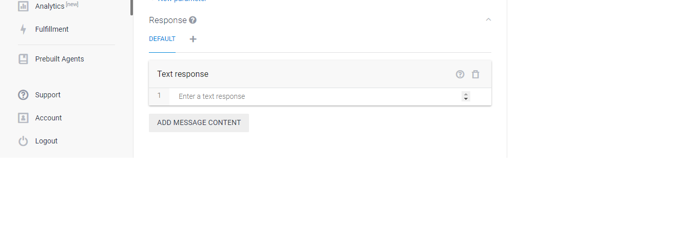

#### Thành viên trong nhóm  
- Tô Mạnh Hiệp
- Nguyễn Văn Tuệ

## Giới thiệu về Natural Language Processing (NLP) và API.ai – Công nghệ tích hợp xử lí ngôn ngữ tự nhiên.

Mục đích: Chủ đề này giới thiệu về Xử Lý Ngôn Ngữ Tự Nhiên  – Một phương pháp mới để giúp cho máy có thể hiểu và phân tích được câu nói của con người và có thể chắc lọc ra những thông tin cần thiết. Bên cạnh đó, chủ đề này còn giới thiệu về công nghệ API.ai – công nghệ xử lý ngôn ngữ tự nhiên và giúp lập trình viên tương tác trao đổi thông qua RESTful Web Services.

- Homepage [API.AI](https://dialogflow.com/) (Mới đổi tên thành  Dialogflow) .
- Documentation [api.ai/docs](https://dialogflow.com/docs/getting-started/basics).

## Khái niệm về Natural Language Processing

[Natural Language Processing (NLP)](https://en.wikipedia.org/wiki/Natural_language_processing) – Xử lý ngôn ngữ tự nhiên là một nhánh của trí tuệ nhân tạo, tập trung vào việc tương tác giữa máy tính và ngôn ngữ tự nhiên của con người, để từ đó máy tính có thể hiểu và thực thi đúng yêu cầu của con người.

Vậy làm thế nào để máy tính có thể hiểu được câu nói của con người?

Sau đây, mình sẽ hướng dẫn bạn đọc cách giúp máy tính hiểu được ngữ nghĩa của một câu nói.

Đầu tiên chúng ta có một vài khái niệm:

**1.  Lexical Category **– Nhóm từ vựng học.
- Khái niệm này giúp định danh cho một tập các từ hoặc cụm từ cùng mang một ý nghĩa hay đề cập đến một nội dung cụ thể.
- Khái niệm này giúp chúng ta có thể phân tích các thành phần trong một câu thành dạng tổng quát để có người khác có thể diễn đạt bằng nhiều cách hay sử dụng từ địa phương, từ lóng, … thì nó cũng cùng chung một ngữ nghĩa.
- Ví du: Food là một Lexical Category bao gồm các từ như bún bò, hủ tiếu, …

- Để hiểu rõ khái niệm này, chúng ta cùng phân tích một câu hỏi đơn giản như sau:

Câu hỏi trên được phân tích thành các Lexical Category như sau

\

+ Action: dùng để chỉ các hành động của con người có liên quan tới thức ăn.
+ Food: dùng để chỉ các món ăn.
+ Where: dùng để xác định các từ để hỏi địa điểm.
+ Delicious: là tập hợp các từ chỉ độ ngon của thức ăn.
+  …: các lexical category khác tùy theo sự phức tạp của của một câu được phân tích

Từ câu ví dụ trên chúng ta có thể gom lại thành một chuỗi các Lexical Category như sau:
**[Action][Food][Where][Delicious]**

**2.  Pattern **– cú pháp hay ngữ pháp hình thành trong một câu.
- Vi dụ:  [Action][Food][Where][Delicious].
=> Mục đích của pattern giúp xác định mẫu câu được dùng trong giao tiếp.

Đến đây, chúng ta đã hình thành nên khái niệm mẫu câu, ngữ pháp của câu để sử dụng trong giao tiếp và truyền đạt theo kiểu chúng ta được học trong ngôn ngữ tiếng Việt hay tiếng Anh.

Tuy nhiên, ngôn ngữ tự nhiên được hiểu theo ngữ cảnh – các câu giao tiếp có ý nghĩa khác nhau tùy theo không gian, địa điểm và nội dung đang được trao đổi, và không theo một một quy tắc nào. Vì vậy, pattern chưa đảm bảo việc xác định chính xác nghĩa một câu.

**3.  Intent **– xác định ý định, hay mục đích của câu được phân tích dựa trên ngữ cảnh giao tiếp.
- Ví dụ:  với câu hỏi “**Ăn phở ở đâu ngon?**”, chúng ta hiểu intent “câu nói mong muốn xác định vị trí quán phở ở đâu là ngon”.

**Tổng kết:** muốn xử lý ngôn ngữ tự nhiên chúng ta cần phải xác định 03 thành phần cơ bản lần lượt là Lexical Category, Pattern, Intent để thông qua đó chúng ta sẽ dạy cho máy hiểu được các câu được chuyển tải trong quá trình giao tiếp.

## API.ai

**1. Giới thiệu và tính năng**
- Api.ai là một framework hỗ trợ xử lý ngôn ngữ tự nhiên (hiện tại, bộ này chưa hỗ trợ tiếng Việt) nhằm hỗ trợ người lập trình xây dựng một công cụ liên quan đến giao tiếp tự động giữa người và máy tính.
- Các tính năng:
	+ Api.ai’s Speech Recognition: Hỗ trợ nhận diện giọng nói, chuyển đổi âm thanh – sound thành dạng văn bản – text.
	+ Natural Language Understanding and Conversation Management: Xử lý ngôn ngữ tự nhiên và hỗ trợ giao tiếp.

**2. Một số khái niệm cơ bản trong API.ai sử dụng**

| **Khái niệm** | **Mô tả** | 
| :-------: | :--: |
| Agent | Tương đương như một ứng dụng trong api.ai. Đây cũng là nơi chúng ta tích hợp vào ứng dụng của mình để có thể dạy và test bot. |
| Entity | Khái niệm tương tự như Lexical Category đã nói trên. |
| Intent | Xác định ngữ cảnh của câu và ứng xử trong giao tiếp. Có ý nghĩa tương tự như phần giải thích về intent trên |
| Action | Khi một intent được trigger thì action sẽ được thực hiện. Action đỏi hỏi các thông tin (parameter) tương ứng được tổng hợp từ các pattern kết hợp với các intent. |
| Context | Xác định ngữ cảnh của câu được phân tích hay giao tiếp. Context bao gồm các intent, cho biết các câu nói đó thuộc những ngữ cảnh tương ứng để có cách ứng xử cho phù hợp. |

- Đọc thêm [Basics Documentation](https://dialogflow.com/docs/getting-started/basics)

**3. Cách sử dụng**
Chúng ta có thể tích hợp api với ứng dụng của chúng ta bằng cách sử dụng REST-like API.

- Đọc thêm về [API](https://vi.wikipedia.org/wiki/Giao_di%E1%BB%87n_l%E1%BA%ADp_tr%C3%ACnh_%E1%BB%A9ng_d%E1%BB%A5ng) 
- Đọc thêm về [REST or RESTFUL](https://en.wikipedia.org/wiki/Representational_state_transfer)

## Hướng dẫn chi tiết sử dụng API.AI 

**1. Create Agent**

- Prebuilt Agent (Một số Agent API.AI xây dựng sẵn theo các tính năng nhất định như đặt vé, hội thoại, ...)

**2. Create Intents**

- Intent Contexts

- Intent Responses

### Demo

- [CHATBOT](https://speakaibot.herokuapp.com/) (Hội thoại tiếng Anh với AI Bot
- [PRONUNCIATION CHECKER](https://speakaibot.herokuapp.com/pronunciation) (Kiểm tra phát âm tiếng anh với AI Bot)
- [VISION DETECT](https://speakaibot.herokuapp.com/vision) (Học từ vựng qua hình ảnh với AI Bot)

### Slide GitPitch 
- https://gitpitch.com/hieptm96/slidechatbot

### Docs

- [API.AI docs](https://api.ai/docs/getting-started/basics)