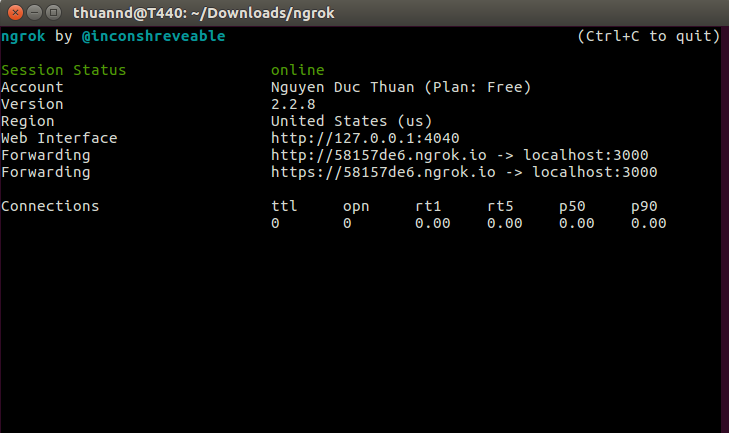
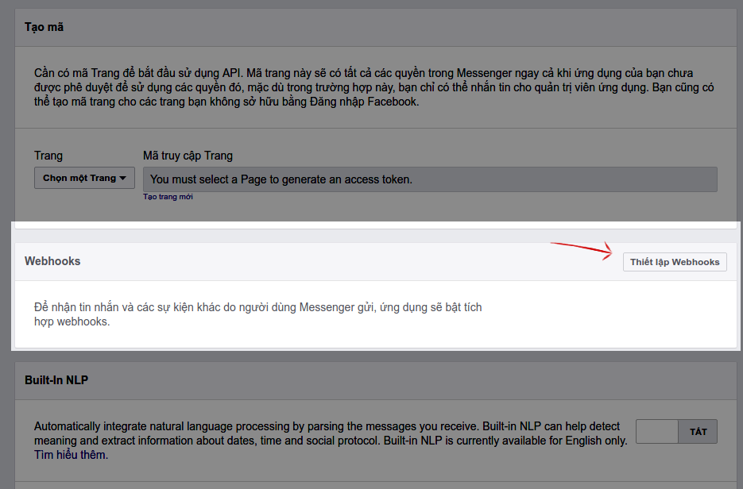
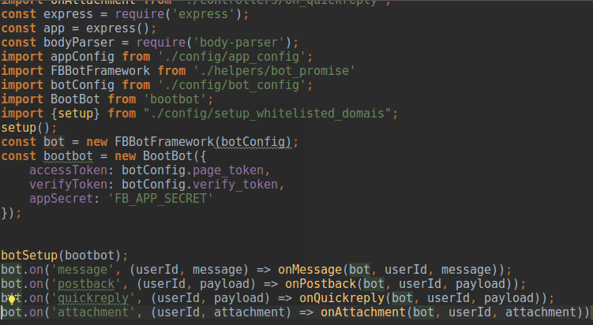

# UET Chatbot - Ứng dụng Facebook Chatbot hỗ trợ sinh viên UET

**Môn học**: Các vấn đề hiện đại trong Công nghệ thông tin

**Giảng viên**: Trương Anh Hoàng

**Nhóm 5**: Facebook Chatbot
- Nguyễn Đức Thuần
- Phan Thị Hà Trang
- Nguyễn Thị Lan
- Nguyễn Văn Nhật

## Danh sách khái niệm, thuật ngữ

| Khái niệm/Thuật ngữ | Giải thích                                                                                                                                                                                                                                                                                                                                                              |
|---------------------|-------------------------------------------------------------------------------------------------------------------------------------------------------------------------------------------------------------------------------------------------------------------------------------------------------------------------------------------------------------------------|
| Webhook             | Webhook hiểu đơn giản thì đây là một công cụ để truy vấn và lưu dữ liệu của một sự kiện xác định. Khi một trong những sự kiện đã đăng ký được kích hoạt, Webhook sẽ gửi một HTTP POST đến một địa chỉ URL được đăng ký từ trước.                                                                                                                                        |
| REST                | REST (**RE**presentational **S**tate **T**ransfer) là một dạng dạng chuyển đổi cấu trúc dữ liệu. Rest API là một ứng dụng chuyển đổi cấu trúc dữ liệu có phương thức để kết nối và ứng dụng khác. Facebook cung cấp REST API để lập trình viên có thể gửi tin nhắn phản hồi đến người dùng, cho dù người dùng viết ứng dụng trả lời bằng bất kỳ ngôn ngữ lập trình nào. |
| Facebook Chatbot    | Facebook Chatbot là một phần mở rộng cho chức năng nhắn tin trên trang Facebook của bạn. Mỗi Chatbot phải được liên kết với một trang Facebook đang tồn tại. Vì vậy, nếu bất cứ ai đang chat với bot của bạn thì họ đang chat với trang Facebook của bạn, nhưng thay vì là cuộc trò chuyện giữa người với người thì bot của bạn nói chuyện với người.                   |
| Elasticsearch       | Elasticsearch là một công cụ tìm kiếm dựa trên phần mềm Lucene. Nó cung cấp một bộ máy tìm kiếm dạng phân tán, có đầy đủ công cụ với một giao diện web HTTP có hỗ trợ dữ liệu JSON.                                                                                                                                                                                     |
| Crawler             | Crawler là 1 từ để ám chỉ các công cụ (phần mềm, modules, plugins… hay đơn giản chỉ là một hàm nhỏ) có chức năng chính là tự động phân tích dữ liệu từ nguồn nội dung sau đó bóc tách những thông tin cần thiết theo tiêu chí mà nó được lập trình viên hệ thống thiết lập.                                                                                             |

## Danh sách hình vẽ

| Hình vẽ  	| Mô tả                                         	|
|----------	|-----------------------------------------------	|
| Hình 1.1 	| Sơ đồ hoạt động của ứng dụng Facebook Chatbot 	|
| Hình 2.1 	| Đăng ký ứng dụng mới                          	|
| Hình 2.2 	| Tạo ứng dụng Messenger                        	|
| Hình 2.3 	| Khởi chạy Ngrok                               	|
| Hình 2.4 	| Thiết lập `page token`                        	|
| Hình 2.5 	| Thiết lập Webhook                             	|
| Hình 2.6 	| Đăng ký Webhook                               	|
| Hình 2.7 	| Cấu trúc bộ sưu tập `users`                   	|
| Hình 2.8 	| Cấu trúc mã nguồn                             	|
| Hình 2.9 	| Tạo luồng sự kiện                             	|
| Hình 3.1 	| Các API được triển khai trên máy chủ tìm kiếm 	|

## Lời mở đầu

Theo thống kê từ Google Analytic của [SGUET](http://sguet.com), hàng tháng có trên 250 lượt truy cập, trên 200 lượt tìm kiếm liên quan đến các câu hỏi thường gặp và thông tin các giảng viên. Tuy nhiên, Mỗi mùa tuyển sinh, hàng chục câu hỏi vẫn được gửi vào một nhóm Facebook do SGUET tạo ra cho thấy tìm kiếm thông qua website vẫn chưa phải là cách thức hiệu quả và tiện lợi nhất đối với sinh viên. Việc này vẫn tồn tại nhược điểm, giả sử có thành viên trong nhóm biết câu trả lời, tuy nhiên vì lý do nào đấy mà câu hỏi có thể bị trôi hoặc quá nhiều thông báo mà bỏ lỡ câu hỏi, câu hỏi sẽ rơi vào tình trạng trả lời chậm hoặc không có người trả lời.  

Do đó, chúng tôi đề xuất một phương án tốt hơn và tiện lợi hơn cho sinh viên trường, cả người hỏi và người trả lời. Chúng tôi đã xây dựng UET Chatbot - một ứng dụng Facebook Chatbot dựa trên [Nền tảng Messenger](https://developers.facebook.com/docs/messenger-platform/introduction). Ứng dụng của chúng tôi có các chức năng chính sau:

- Tra cứu các câu hỏi thường gặp của sinh viên.

- Tra cứu thông tin các giảng viên (điện thoại liên hệ, phòng làm việc, đơn vị làm việc, email, website, hướng nghiên cứu,...).

- Tra cứu thông tin môn học (số tín chỉ, môn học tiên quyết,...).

- Tra cứu các văn bản, biểu mẫu thường dùng.

## Chương 1: Tổng quan về kiến trúc ứng dụng

Dựa vào cơ chế hoạt động của Facebook Chatbot, để xây dựng một ứng dụng Facebook Chatbot, ta cần xây dựng một ứng dụng tương tác hai chiều với Facebook và cần thực hiện được hai việc như sau: 

1. Viết ứng dụng Webhook (máy chủ Chatbot) và gửi đăng ký địa chỉ Webhook với Facebook.

2. Nhận tin nhắn từ người dùng thông qua ứng dụng Webhook, xử lý nội dung và phản hồi lại cho người dùng.

<i>Hình 1.1: Sơ đồ hoạt động của ứng dụng Facebook Chatbot</i>

Hình 1.1 mô tả ứng dụng Facebook Chatbot mà chúng tôi đã triển khai. Hai mũi tên ngược chiều nhau giữa `Facebook` và `Chatbot server` thể hiện tương tác hai chiều thông qua Webhook và Rest API. Ứng dụng được chia làm 2 tầng chính với các chức năng như sau:

- Máy chủ Chatbot (Chatbot server) có nhiệm vụ kết nối hai chiều với Facebook thông qua Webhook và Rest API, tiếp nhận, xử lý và điều hướng các hành động và tin nhắn của nguời dùng. Đồng thời dữ liệu về người dùng cũng như các tin nhắn của họ cũng được máy chủ lưu lại.
    
- Máy chủ tìm kiếm (Search server) đóng vai trò cung cấp các API tìm kiếm các môn học, giảng viên,... Máy chủ tìm kiếm sẽ thực hiện các thao tác với dữ liệu về môn học, giảng viên,... trên MySQL và Elastic Search, quản lý quá trình đẩy dữ liệu từ MySQL sang Elastic Search (indexing) nhằm mục đích thực hiện truy vấn một cách nhanh chóng để lấy dữ liệu cần tìm kiếm.

Khi người dùng Facebook gửi tin nhắn tới trang (trên Facebook), Facebook sẽ gọi tới Webhook của máy chủ Chatbot. Máy chủ Chatbot sẽ lưu thông tin người dùng và các tin nhắn vào MongoDB. Đối với các yêu cầu tìm kiếm của người dùng, máy chủ Chatbot gọi tới các API tìm kiếm tương ứng trên máy chủ tìm kiếm. Máy chủ tìm kiếm sẽ tìm chúng trên Elastic Search, sau đó trả kết quả về. Sau khi nhận được kết quả tìm kiếm, máy chủ Chatbot sẽ chọn một cách hiển thị thích hợp cho kết quả, rồi gửi kết quả tới người dùng thông qua Facebook Chatbot API.

Song song với đó, các trình thu thập thông tin sẽ thu thập dữ liệu từ các nguồn khác nhau như trang web của trường, của các khoa,... để bổ sung hoặc cập nhật dữ liệu trên MySQL. Máy chủ tìm kiếm sẽ đảm nhận vai trò đưa dữ liệu từ MySQL sang Elastic Search hàng ngày. 

## Chương 2: Máy chủ Chatbot

### 2.1. Cơ chế hoạt động của Facebook Chatbot

Đầu tiên, ta phải tạo và đăng kí địa chỉ của máy chủ Chatbot nhận tin nhắn trên trang cho Webhook của Facebook với Facebook. Khi có tin nhắn gửi đến trang, Facebook sẽ gửi một HTTP POST thông qua Webhook này để chúng ta tiếp tục xử lý.

Sau khi xử lý xong, nếu muốn trả lời lại người dùng, chúng ta phải gửi tin nhắn qua Rest API của Facebook. Nhờ đó, một tin nhắn từ trang tới người dùng được Facebook gửi đi.

### 2.2. Kết nối hai chiều với Facebook thông qua Webhook và Rest API

Phần này sẽ tập trung vào cách thức xây dựng máy chủ Chatbot để tiếp nhận các yêu cầu của người dùng và xử lý hoặc điều hướng xử lý chúng. Máy chủ Chatbot có thể được viết bằng bất kỳ ngôn ngữ lập trình nào, bài báo cáo này sẽ trình bày một ứng dụng mẫu do chúng tôi xây dựng dựa trên Framework ExpressJS của Nodejs và cơ sở dữ liệu được sử dụng là MongoDB

#### 2.2.1. Chuẩn bị

Chúng ta cần chuẩn bị và cài đặt các công cụ, công nghệ như sau:

- Hệ quản trị Cơ sở dữ liệu: [MongoDB](https://www.mongodb.com).

- Công cụ để đưa ứng dụng trên máy chủ nội bộ của bạn lên Internet: [Ngrok](https://ngrok.com/download). 

- Tạo một trang (Fanpage) Facebook (hoặc sử dụng một trang mà bạn có quyền quản trị) để đăng ký Webhook.
 
- Máy chủ Chatbot mẫu (ứng dụng mẫu) của chúng tôi được xây dựng trên Framework ExpressJS tại [đây](https://github.com/nguyenducthuanuet/facebookChatbot).

Các hướng dẫn dưới đây được viết dựa trên ứng dụng mẫu này.
    
##### Bước 1: Cài đặt ứng dụng mẫu 
    
- Chạy lệnh dưới đây (trong thư mục gốc của ứng dụng) sau khi tải về thành công mã nguồn của ứng dụng:
    
        $ npm install
    
- Nhân bản tệp `.env.sample` và đặt tên là `.env`.

- Truy cập [Facebook Developer](https://developers.facebook.com/), tạo một ứng dụng. Sau đó vào chọn ứng dụng Messenger.

<i>Hình 2.1: Đăng ký một ứng dụng mới trên Facebook Developer.</i>

<i>Hình 2.2: Tạo ứng dụng Messenger.</i>

- Tạo cơ sở dữ liệu mới trên MongoDB có tên giống với `DB_DATABASE=` trong tệp `.env` (ở ứng dụng mẫu là `facebookChatbot`), trong cơ sở dữ liệu tạo 2 bộ dữ liệu (collection) `users` và `lecturers`.
 
- Chạy lệnh sau để khởi động ứng dụng:

        $ npm start
        
- Truy cập `http://localhost:3000/seed` để tạo dữ liệu về giảng viên và hướng nghiên cứu (phần dữ liệu này về sau sẽ được chuyển sang MySQL ở máy chủ tìm kiếm để sử dụng Elastic Search).  

##### Bước 2: Kết nối ứng dụng Chatbot với Webhook của Facebook

- Khởi động Ngrok tại cổng 3000:

        $ ngrok http 3000
        
Sau sao chép trường địa chỉ `Forwarding (https)` (Như hình vẽ dưới đây là https://58157de6.ngrok.io).
        

<i>Hình 2.3: Khởi chạy Ngrok tại cổng 3000.</i>

- Trong ứng dụng Messenger vừa tạo ở Bước 1, chọn trang mà bạn có quyền quản trị để lấy mã truy cập trang. Sao chép và dán mã truy cập trang vào dòng `PAGE_TOKEN=` trong tệp `.env`.

<i>Hình 2.4: Thiết lập trường `PAGE_TOKEN` cho ứng dụng.</i>

- Trên trang Facebook Developer, chọn phần `Thiết lập Webhook`.

<i>Hình 2.5: Thiết lập Webhook.</i>

  
Tại hộp thoại hiện lên, điền URL gọi lại giống `Fowarding (https)` của Ngrok và thêm `/Webhook` vào sau (như với ứng dụng mẫu sẽ là https://58157de6.ngrok.io/webhook). 

Trường `Mã xác minh` nhập giống `VERIFY_TOKEN=` trong tệp `.env` (ở project mẫu là `verify_token`). `Trường gửi` chúng ta chọn `messages` và `messaging_postbacks`.

<i>Hình 2.6: Đăng ký Webhook.</i>

### 2.3. Xây dựng máy chủ Chatbot nhận, xử lý tin nhắn và phản hồi tin nhắn phù hợp

Việc xây dựng máy chủ Chatbot như thế nào, phản hồi thông điệp ra sao phụ thuộc rất nhiều vào mục đích của Chatbot để tạo nên các hàm cũng như gọi các API để lấy dữ liệu tương ứng. Tuy nhiên, do các ứng dụng Chatbot đều xây dựng dựa trên các giao diện ứng dụng (API) mà Facebook cung cấp, chính vì vậy mà các sự kiện xử lý và luồng dữ liệu đều xoay quanh các API này.

Phần này sẽ trình bày cách tổ chức và xây dựng mã nguồn ứng dụng Chatbot của chúng tôi nhằm mục đích tham khảo.
Ứng dụng Chatbot của chúng tôi có hai tính năng chính là tra cứu các thông tin như thông tin giảng viên, ngành học, môn học và hỏi đáp thông tin các vấn đề xoay quanh một sinh viên UET.

#### 2.3.1. Xây dựng cơ sở dữ liệu

Các dữ liệu trong bài toán này có thể được chia làm hai phần: 

- Dữ liệu về người dùng và tin nhắn của họ: Dữ liệu này biến động thường xuyên trong quá trình sử dụng nên chúng ta chọn MongoDB để lưu trữ do việc nó có có dạng NoSQL, và việc kết nối giữa NodeJS với MongoDB rất đơn giản.

- Dữ liệu phục vụ người dùng cần tìm kiếm (thông tin giảng viên, hướng nghiên cứu, môn học, tài liệu,...): Dữ liệu này ít biến động, chỉ có bổ sung thêm khi thu thập được thêm thông tin, nhưng lại cần tìm kiếm nhiều. Do đó ta tách phần dữ liệu này ra cùng với việc xử lý tìm kiếm trên dữ liệu này thành 1 tầng khác, sẽ được trình bày ở phần sau.

Như vậy ở MongoDB ta cần xây dựng một bộ sưu tập (collection) `users` có cấu trúc như sau.

Hình 2.7: Cấu trúc bộ sưu tập `users`.

#### 2.3.2. Xây dựng các luồng xử lý

Khi người dùng thực hiện một hành động (gửi tin, chọn menu, bấm một nút, chọn danh sách, gửi tệp,...) khi nhắn tin với trang, Facebook sẽ gửi một sự kiện qua Webhook của trang, kèm theo đó là dữ liệu mà người dùng gửi (tin nhắn, tệp, nút...). Tất cả các hành động được chia vào 4 loại sự kiện:

- message: Sự kiện khi người dùng gửi tin nhắn. Dữ liệu kèm theo sự kiện là tin nhắn mà người dùng gửi.
 
- postback: Sự kiện khi người dùng bấm một nút hoặc chọn một mục từ một danh sách. Dữ liệu kèm theo là mã postback của nút, do ứng dụng của ta quy định.

- quickreply: Sự kiện khi người dùng chọn một câu trả lời trong danh sách các câu trả lời gợi ý của ứng dụng. Dữ liệu là mã quickreply của câu trả lời nhanh, do ứng dụng của ta quy định.

- attachment: Sự kiện khi người dùng gửi một tệp. Dữ liệu kèm theo là nội dung tệp.

Ở bài toán của project mẫu, ta không cần dùng tới sự kiện attachment nên chỉ 3 sự kiện message, postback, quickreply được đề cập.

Hình 2.8: Cấu trúc mã nguồn.

### 2.3.3. Làm sao để xây dựng được luồng xử lý phù hợp với các tin nhắn của người dùng.

Khi ứng dụng của bạn yêu cầu nhập tên giảng viên khi tra cứu giảng viên, hay nhập câu hỏi khi muốn tra cứu hỏi đáp. Vậy làm sao để phân biệt được tin nhắn nào là để tra cứu giảng viên hay hỏi đáp khi mà các tin nhắn gửi đến chỉ được gửi hoàn toàn riêng rẽ và độc lập ? Chính vì vậy, chúng tôi đã sử dụng collection users để xử lý vấn đề này. Khi một tin nhắn văn bản gửi đến, chúng tôi sẽ dựa vào postback hay quickreply cuối cùng được gửi đến để xác định yêu cầu tra cứu. Ví dụ:

Hình 2.9: Tạo luồng sự kiện.

Khi một tin nhắn văn bản được gửi đến, chúng tôi sẽ truy vấn action cuối cùng, sau đó mới đưa ra phương thức xử lý của action đó.

## Chương 3: Tầng máy chủ tìm kiếm

Máy chủ tìm kiếm chúng tôi xây dựng dựa trên dự án có sẵn là [website sguet.com](http://sguet.com) nên chúng tôi không công bố mã nguồn mà chỉ hướng dẫn cách xây dựng một máy chủ tìm kiếm tương tự.

### 3.1. Công nghệ

Máy chủ tìm kiếm được xây dựng trên những công nghệ sau:

- Framework: [Laravel 5.3](https://laravel.com/docs/5.3) trên [PHP 5.6.4](http://php.net/).

- Hệ quản trị Cơ sở dữ liệu: [MySQL](https://www.mysql.com/).

- Công cụ tìm kiếm: [Elasticsearch](https://www.elastic.co/).

- Thư viện Truy vấn Elasticsearch trên PHP: [elasticsearch/elasticsearch](https://github.com/elastic/elasticsearch) kết hợp với [guzzle/guzzle](https://github.com/guzzle/guzzle).   

### 3.2. Chuyển dữ liệu MySQL lên Elasticsearch

Hệ thống crawler của chúng tôi được thiết kế đẩy dữ liệu trực tiếp vào MySQL. Dữ liệu trên Elasticsearch có cấu trúc NoSQL, rất khác so với MySQL. Do đó, đối với mỗi thực thể (model), chúng tôi chỉ lấy các thuộc tính và các quan hệ (hoặc thuộc tính của quan hệ) cần dùng cho tìm kiếm, sau đó chuyển thành một đối tượng JSON rồi đẩy lên Elasticsearch.  

Quá trình đẩy dữ liệu từ MySQL lên Elasticsearch được thực thi bởi máy chủ tìm kiếm. Khi mới cài đặt Elasticsearch, để chuyển một nguồn dữ liệu có sẵn từ MySQL lên Elasticsearch, chúng tôi sử dụng cơ chế [Bulk API](https://www.elastic.co/guide/en/elasticsearch/reference/current/docs-bulk.html). Cơ chế này giúp đẩy một lượng lớn dữ liệu cùng lúc thay vì tuần tự từng tài liệu một. Các dữ liệu mới được thêm, sửa, xoá trong thời gian sử dụng chúng tôi cũng sử dụng cùng cơ chế trên để đẩy lên Elasticsearch ngay lập tức.  

### 3.3. Tìm kiếm trên Elasticsearch

Chúng tôi sử dụng cơ chế [Multi Match Query](https://www.elastic.co/guide/en/elasticsearch/reference/current/query-dsl-multi-match-query.html) giúp tìm kiếm đồng thời trên nhiều trường của tài liệu. Cụ thể:

- Tra cứu câu hỏi thường gặp: Tìm theo tiêu đề, câu hỏi tương tự (paraphrases), nhãn (tags).

- Tra cứu thông tin giảng viên: Tìm theo tên, tên rút gọn (slug), chức vụ và đơn vị làm việc.

- Tra cứu thông tin môn học: Tìm theo mã môn học, tên tiếng Việt, tên tiếng Anh.

- Tra cứu văn bản, biểu mẫu: Tìm theo tên văn bản, biểu mẫu.

Đồng thời, chúng tôi sử dụng [Source Filtering](https://www.elastic.co/guide/en/elasticsearch/reference/current/search-request-source-filtering.html) để chỉ lấy ra trường `id` của tài liệu. Điều này giúp tăng hiệu năng tìm kiếm trên Elasticsearch và tối giản kết quả trả về. 

Từ danh sách `id` trả về từ Elasticsearch, chúng tôi tìm kiếm các bản ghi trên MySQL, sử dụng [ORDER BY FIELD()](https://dba.stackexchange.com/questions/109120/how-does-order-by-field-in-mysql-work-internally) để kết quả trả về có cùng thứ tự với danh sách `id`. Cách làm này giúp phòng tránh trường hợp dữ liệu không đồng bộ giữa MySQL và Elasticsearch (có thể gây ra do quá trình đẩy dữ liệu bị lỗi).

### 3.4. Các API

Hình 3.1: Các API được triển khai trên máy chủ tìm kiếm.

Hình trên là danh sách các API mà máy chủ tìm kiếm cung cấp, theo thứ tự là:

- API tìm kiếm câu hỏi thường gặp của sinh viên với đầu vào `query` là tiêu đề, từ khoá hoặc câu hỏi tương tự (`parapharses`).

- API tra cứu nội dung chi tiết của một câu hỏi với đầu vào là `id` của câu hỏi.

- API tìm kiếm môn học với đầu vào `query` là tên môn học (tiếng Anh hoặc tiếng Việt) hoặc mã môn học.

- API tra cứu nội dung chi tiết của một môn học với đầu vào là `id` của môn học.

- API tìm kiếm văn bản, biểu mẫu với đầu vào `query` là tên văn bản, biểu mẫu.

- API tra cứu nội dung chi tiết của một văn bản, biểu mẫu với đầu vào là `id` của văn bản, biểu mẫu.

Máy chủ tìm kiếm đang được chạy trên IP `52.15.160.33`. API được cung cấp có dạng `http://52.15.160.33/api/URI` với `URI` được liệt kê trong hình 3.1. Ví dụ: [http://52.15.160.33/api/subjects/query=Kiểm thử](http://52.15.160.33/api/subjects/query=Kiểm thử) 

## Kết luận

### Kết quả đạt được

Ứng dụng Facebook Chatbot tập trung vào mục đích cung cấp một nguồn tra cứu trực tuyến cho sinh viên, giúp sinh viên nhanh chóng tìm kiếm các thông tin hữu ích về học tập. Hiện tại ứng dụng đã đạt được các kết quả như sau:

- Giải đáp các câu hỏi thường gặp trong nhiều chủ đề khác nhau của sinh viên với nguồn dữ liệu là 94 câu hỏi thường gặp do các thành viên SGUET tổng hợp.

- Cung cấp nhiều thông tin hữu ích (email, số điện thoại, phòng làm việc, hướng nghiên cứu) của trên 300 giảng viên và trên 70 đơn vị thuộc trường ĐH Công nghệ.

- Đáp ứng tìm kiếm văn bản, biểu mẫu nhanh chóng với trên 30 văn bản, biểu mẫu đã được thu thập.

- Trên 150 môn học đã có sẵn thông tin để phục vụ việc tra cứu.

### Định hướng tương lai

Với hệ thống máy thu thập thông tin, ứng dụng sẽ tiếp tục bổ sung và làm mịn thêm thông tin về các giảng viên và đơn vị trong trường. Đồng thời với đó, các câu hỏi thường gặp sẽ được bổ sung thêm để có thể giải đáp được mọi thắc mắc của sinh viên.

### Tài liệu tham khảo

### Phụ lục