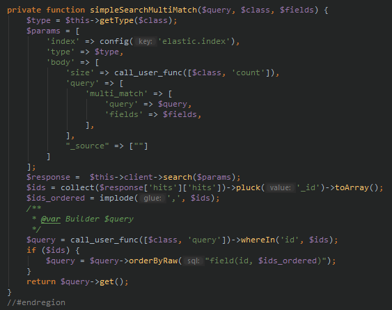

# Ứng dụng chatbot hỗ trợ sinh viên UET

**Môn học**: Các vấn đề hiện đại trong Công nghệ thông tin

**Giảng viên**: Trương Anh Hoàng

**Nhóm 5**: Facebook Chatbot
- Nguyễn Đức Thuần
- Phan Thị Hà Trang
- Nguyễn Thị Lan
- Nguyễn Văn Nhật

## Tóm tắt

## Danh sách thuật ngữ và viết tắt

## Danh sách bảng

## Danh sách hình vẽ

## Lời mở đầu

## Chương 1: Các khái niệm cơ bản

Trước khi đi vào xây dựng ứng dụng, ta cần hiểu về cơ chế hoạt động của Facebook Chatbot và các khái niệm liên quan.

### 1.1. Webhook là gì

Webhook hiểu đơn giản thì đây là một công cụ để truy vấn và lưu dữ liệu của một sự kiện xác định. Khi một trong những sự kiện đã đăng ký được kích hoạt, webhook sẽ gửi một HTTP POST đến một địa chỉ URL được đăng ký từ trước.

### 1.2. Rest API là gì

REST (**RE**presentational **S**tate **T**ransfer) là một dạng dạng chuyển đổi cấu trúc dữ liệu. Rest API là một ứng dụng chuyển đổi cấu trúc dữ liệu có phương thức để kết nối và ứng dụng khác. Facebook cung cấp REST API để lập trình viên có thể gửi tin nhắn phản hồi đến người dùng, cho dù người dùng viết ứng dụng trả lời bằng bất kỳ ngôn ngữ lập trình nào.

### 1.3. Cơ chế hoạt động của Facebook Chatbot

Đầu tiên, ta phải tạo và đăng kí địa chỉ ứng dụng webhook cho trang với Facebook. Khi có tin nhắn gửi đến trang, Facebook sẽ gửi một HTTP POST thông qua Webhook này để chúng ta tiếp tục xử lý.

Sau khi xử lý xong, nếu muốn trả lời lại người dùng, chúng ta phải gửi tin nhắn qua Rest API của Facebook. Nhờ đó, một tin nhắn từ trang của ta tới người dùng được Facebook gửi đi.

## Chương 2: Tổng quan về kiến trúc ứng dụng

Dựa vào cơ chế hoạt động của Facebook Chatbot, để xây dựng một ứng dụng Facebook Chatbot, ta cần xây dựng một ứng dụng tương tác hai chiều với Facebook và cần thực hiện được hai việc như sau: 

1. Viết ứng dụng Webhook (máy chủ Chatbot) và gửi đăng ký địa chỉ Webhook với Facebook.

2. Nhận tin nhắn từ người dùng thông qua ứng dụng webhook, xử lý nội dung và phản hồi lại cho người dùng.

<i>Hình 1.1: Sơ đồ hoạt động của ứng dụng Facebook Chatbot</i>

Hình 1.1 mô tả ứng dụng Facebook Chatbot mà chúng tôi đã triển khai. Hai mũi tên ngược chiều nhau giữa `Facebook` và `Chatbot server` thể hiện tương tác hai chiều thông qua Webhook và Rest API. Ứng dụng được chia làm 2 tầng chính với các chức năng như sau:

- Máy chủ Chatbot (Chatbot server) có nhiệm vụ kết nối hai chiều với Facebook thông qua Webhook và Rest API, tiếp nhận, xử lý và điều hướng các hành động và tin nhắn của nguời dùng. Đồng thời dữ liệu về người dùng cũng như các tin nhắn của họ cũng được máy chủ lưu lại.
    
- Máy chủ tìm kiếm (Search server) đóng vai trò cung cấp các API tìm kiếm các môn học, giảng viên,... Máy chủ tìm kiếm sẽ thực hiện các thao tác với dữ liệu về môn học, giảng viên,... trên MySQL và Elastic Search, quản lý quá trình đẩy dữ liệu từ MySQL sang Elastic Search (indexing) nhằm mục đích thực hiện truy vấn một cách nhanh chóng để lấy dữ liệu cần tìm kiếm.

Khi người dùng Facebook gửi tin nhắn tới trang (trên Facebook), Facebook sẽ gọi tới Webhook của máy chủ Chatbot. Máy chủ Chatbot sẽ lưu thông tin người dùng và các tin nhắn vào MongoDB. Đối với các yêu cầu tìm kiếm của người dùng, máy chủ Chatbot gọi tới các API tìm kiếm tương ứng trên máy chủ tìm kiếm. Máy chủ tìm kiếm sẽ tìm chúng trên Elastic Search, sau đó trả kết quả về. Sau khi nhận được kết quả tìm kiếm, máy chủ Chatbot sẽ chọn một cách hiển thị thích hợp cho kết quả, rồi gửi kết quả tới người dùng thông qua Facebook Chatbot API.

Song song với đó, các trình thu thập thông tin sẽ thu thập dữ liệu từ các nguồn khác nhau như trang web của trường, của các khoa,... để bổ sung hoặc cập nhật dữ liệu trên MySQL. Máy chủ tìm kiếm sẽ đảm nhận vai trò đưa dữ liệu từ MySQL sang Elastic Search hàng ngày. 

## Chương 3: Máy chủ chatbot 

Máy chủ chatbot chúng ta sử dụng ở đây được xây dựng trên framework ExpressJS, cơ sở dữ liệu là MongoDB.

### 3.1. Kết nối hai chiều với Facebook thông qua Webhook và Rest API

Phần này sẽ tập trung vào cách thức xây dựng máy chủ chatbot để tiếp nhận các yêu cầu của người dùng và xử lý hoặc điều hướng xử lý chúng. 

#### 3.1.1. Chuẩn bị

Chúng ta cần chuẩn bị và cài đặt các công cụ, công nghệ như sau:

- Framework: ExpressJS.

- Hệ quản trị Cơ sở dữ liệu: MongoDB.

- Tunnel: [Ngrok](https://ngrok.com/download). 

- Tạo một trang (fanpage) Facebook (hoặc sử dụng một trang mà bạn có quyền quản trị) để đăng ký webhook.
 
- Tạo một project cung cấp webhook, tham khảo project mẫu được viết trên ExpressJS tại [đây](https://github.com/nguyenducthuanuet/facebookchatbot).

Các hướng dẫn dưới đây được viết dựa trên project mẫu.
    
##### Bước 1: Cài đặt ứng dụng mẫu 
    
- Chạy lệnh dưới đây sau khi tải project về:
    
        $ npm install
    
- Nhân bản tệp `.env.sample` và đặt tên là `.env`.

- Truy cập [Facebook Developer](https://developers.facebook.com/), tạo một ứng dụng. Sau đó vào chọn ứng dụng Messenger.

- Tạo cơ sở dữ liệu mới trên MongoDB có tên giống với `DB_DATABASE=` trong tệp `.env` (ở project mẫu là `facebookchatbot`), trong DB tạo 2 collection `users` và `lecturers`.
 
- Chạy lệnh sau để khởi động project:

        $ npm start
        
- Truy cập `localhost:3000/seed` để tạo dữ liệu về giảng viên và hướng nghiên cứu (phần dữ liệu này về sau sẽ được chuyển sang MySQL ở máy chủ tìm kiếm để sử dụng Elastic Search).  

##### Bước 2: Kết nối ứng dụng webhook với Facebook

- Khởi động Ngrok và mở cổng http 3000:

        $ ngrok http 3000
        
Sau đó chú ý tới địa chỉ `Forwarding (https)` (ở hình vẽ dưới đây là https://58157de6.ngrok.io).
        

- Trong ứng dụng Messenger vừa tạo ở bước 1, chọn trang mà bạn có quyền quản trị để lấy mã truy cập Trang. Dán mã truy cập trang vào dòng `PAGE_TOKEN=` trong tệp `.env`.

- Trên trang Facebook Developer, chọn phần `Thiết lập webhook`.

  
Tại hộp thoại hiện lên, điền URL gọi lại giống `Fowarding (https)` của Ngrok và thêm `/webhook` vào sau (ở project mẫu là https://58157de6.ngrok.io/webhook). 

Trường `Mã xác minh` nhập giống `VERIFY_TOKEN=` trong tệp `.env` (ở project mẫu là `verify_token`). `Trường gửi` chúng ta chọn `messages` và `messaging_postbacks`.

### 3.2. Xây dựng máy chủ chatbot nhận, xử lý tin nhắn và phản hồi tin nhắn phù hợp

Việc xây dựng máy chủ chatbot như thế nào, phản hồi thông điệp ra sao phụ thuộc rất nhiều vào mục đích của chatbot để tạo nên các hàm cũng như gọi các API để lấy dữ liệu tương ứng. Tuy nhiên, do các ứng dụng chatbot đều xây dựng dựa trên các giao diện ứng dụng (API) mà Facebook cung cấp, chính vì vậy mà các sự kiện xử lý và luồng dữ liệu đều xoay quanh các API này.

Phần này sẽ trình bày cách tổ chức và xây dựng mã nguồn nhằm đáp ứng mụch đích của chatbot mà chúng tôi xây dựng, bao gồm hai tính năng chính là tra cứu và hỏi đáp thông tin.

#### 3.2.1. Xây dựng cơ sở dữ liệu

Dữ liệu trong bài toán nào có thể được chia làm hai phần: 

- Dữ liệu về người dùng và tin nhắn của họ: Dữ liệu này biến động thường xuyên trong quá trình sử dụng nên chúng ta chọn MongoDB để lưu trữ do việc nó có có dạng NoSQL, và việc kết nối giữa NodeJS với MongoDB rất đơn giản.

- Dữ liệu phục vụ người dùng cần tìm kiếm (thông tin giảng viên, hướng nghiên cứu, môn học, tài liệu,...): Dữ liệu này ít biến động, chỉ có bổ sung thêm khi thu thập được thêm thông tin, nhưng lại cần tìm kiếm nhiều. Do đó ta tách phần dữ liệu này ra cùng với việc xử lý tìm kiếm trên dữ liệu này thành 1 tầng khác, sẽ được trình bày ở phần sau.

Như vậy ở MongoDB ta cần xây dựng 1 collection `users` có cấu trúc như sau.

#### 3.2.2. Xây dựng các luồng xử lý

Khi người dùng thực hiện một hành động (gửi tin, chọn menu, bấm một nút, chọn danh sách, gửi tệp,...) khi nhắn tin với trang, Facebook sẽ gửi một sự kiện qua webhook của trang, kèm theo đó là dữ liệu mà người dùng gửi (tin nhắn, tệp, nút...). Tất cả các hành động được chia vào 4 loại sự kiện:

- message: Sự kiện khi người dùng gửi tin nhắn. Dữ liệu kèm theo sự kiện là tin nhắn mà người dùng gửi.
 
- postback: Sự kiện khi người dùng bấm một nút hoặc chọn một mục từ một danh sách. Dữ liệu kèm theo là mã postback của nút, do ứng dụng của ta quy định.

- quickreply: Sự kiện khi người dùng chọn một câu trả lời trong danh sách các câu trả lời gợi ý của ứng dụng. Dữ liệu là mã quickreply của câu trả lời nhanh, do ứng dụng của ta quy định.

- attachment: Sự kiện khi người dùng gửi một tệp. Dữ liệu kèm theo là nội dung tệp.

Ở bài toán của project mẫu, ta không cần dùng tới sự kiện attachment nên chỉ 3 sự kiện message, postback, quickreply được đề cập.

### 3.2.3. Làm sao để xây dựng được luồng xử lý phù hợp với các tin nhắn của người dùng.

Khi ứng dụng của bạn yêu cầu nhập tên giảng viên khi tra cứu giảng viên, hay nhập câu hỏi khi muốn tra cứu hỏi đáp. Vậy làm sao để phân biệt được tin nhắn nào là để tra cứu giảng viên hay hỏi đáp khi mà các tin nhắn gửi đến chỉ được gửi hoàn toàn riêng rẽ và độc lập ? Chính vì vậy, chúng tôi đã sử dụng collection users để xử lý vấn đề này. Khi một tin nhắn văn bản gửi đến, chúng tôi sẽ dựa vào postback hay quickreply cuối cùng được gửi đến để xác định yêu cầu tra cứu. Ví dụ:

Khi một tin nhắn văn bản được gửi đến, chúng tôi sẽ truy vấn action cuối cùng, sau đó mới đưa ra phương thức xử lý của action đó.

## Chương 4: Tầng máy chủ tìm kiếm

Máy chủ tìm kiếm chúng tôi xây dựng dựa trên project có sẵn [sguet.com](http://sguet.com) nên chúng tôi không công bố mã nguồn mà chỉ hướng dẫn cách thiết lập một máy chủ tìm kiếm tương tự.

### 4.1. Chuẩn bị

Máy chủ tìm kiếm được xây dựng trên những công nghệ sau:

- Framework: [Laravel 5.*]().

- Hệ quản trị Cơ sở dữ liệu: [MySQL]().

- Máy tìm kiếm: [Elastic Search]().

- Cơ sở dữ liệu: Tạo một cơ sở dữ liệu mới, chạy tệp `.sql` trong project mẫu để nhập các dữ liệu tìm kiếm, cụ thể:

    - Bảng `faqs`, `taggable`, `tags`: Dữ liệu về các câu hỏi thường gặp của sinh viên cùng các nhãn hỗ trợ tìm kiếm.
    
    - Bảng `documents`: Dữ liệu về các văn bản, biểu mẫu của trường.
    
    - Bảng `subjects`: Dữ liệu về các môn học.

### 4.2. Chuyển đổi dữ liệu từ MySQL lên Elastic Search

Sử dụng thư viện [elasticsearch/elasticsearch]() và cơ chế `bulk index` để đẩy dữ liệu từ MySQL sang Elastic Search. Hình 4.1 dưới đây là đoạn mã nguồn sử dụng `bulk index` để đẩy dữ liệu lên Elastic Search.  

 

Hình 4.1: Đoạn mã nguồn đẩy dữ liệu từ MySQL sang Elastic Search (indexing) được viết bằng PHP.

### 4.3. Tìm kiếm trên Elastic Search

Hình 4.2: Đoạn mã nguồn tìm kiếm trên Elastic Search được viết bằng PHP.

Trong hình 4.2, để tìm kiếm hiệu quả trên Elastic Search, chúng ta sử dụng `multi_match` với `fields` là các trường cần tìm kiếm (ví dụ, tìm môn học thì sẽ tìm trên mã môn học, tên môn học, tên môn học bằng tiếng Anh).

`_source`  ta để `""` có nghĩa là chỉ lấy `id` của dữ liệu trả về, bởi ta cần lọc lại một lần trên MySQL phòng trường hợp dữ liệu mới cập nhật chưa được đẩy lên Elastic Search.

### 4.4. Cung cấp API để tìm kiếm

Hình 4.3: Các API được triển khai trên máy chủ tìm kiếm.

Hình 4.3 là danh sách các API mà máy chủ tìm kiếm cung cấp, theo thứ tự là:

- API tìm kiếm câu hỏi thường gặp của sinh viên với đầu vào là tiêu đề, từ khoá hoặc câu hỏi tương tự (`parapharses`).

- API tra cứu nội dung chi tiết của một câu hỏi với đầu vào là `id` của câu hỏi.

- API tìm kiếm môn học với đầu vào là tên môn học (tiếng Anh hoặc tiếng Việt) hoặc mã môn học.

- API tra cứu nội dung chi tiết của một môn học với đầu vào là `id` của môn học.

- API tìm kiếm văn bản, biểu mẫu với đầu vào là tên văn bản, biểu mẫu.

- API tra cứu nội dung chi tiết của một văn bản, biểu mẫu với đầu vào là `id` của văn bản, biểu mẫu.

## Kết luận

### Kết quả đạt được

Ứng dụng Facebook Chatbot tập trung vào mục đích cung cấp một nguồn tra cứu trực tuyến cho sinh viên, giúp sinh viên nhanh chóng tìm kiếm các thông tin hữu ích về học tập. Hiện tại ứng dụng đã đạt được các kết quả như sau:

- Giải đáp các câu hỏi thường gặp trong nhiều chủ đề khác nhau của sinh viên với nguồn dữ liệu là 94 câu hỏi thường gặp do các thành viên SGUET tổng hợp.

- Cung cấp nhiều thông tin hữu ích (email, số điện thoại, phòng làm việc, hướng nghiên cứu) của trên 300 giảng viên và trên 70 đơn vị thuộc trường ĐH Công nghệ.

- Đáp ứng tìm kiếm văn bản, biểu mẫu nhanh chóng với trên 30 văn bản, biểu mẫu đã được thu thập.

- Trên 150 môn học đã có sẵn thông tin để phục vụ việc tra cứu.

### Định hướng tương lai

Với hệ thống máy thu thập thông tin, ứng dụng sẽ tiếp tục bổ sung và làm mịn thêm thông tin về các giảng viên và đơn vị trong trường. Đồng thời với đó, các câu hỏi thường gặp sẽ được bổ sung thêm để có thể giải đáp được mọi thắc mắc của sinh viên.

### Tài liệu tham khảo

### Phụ lục